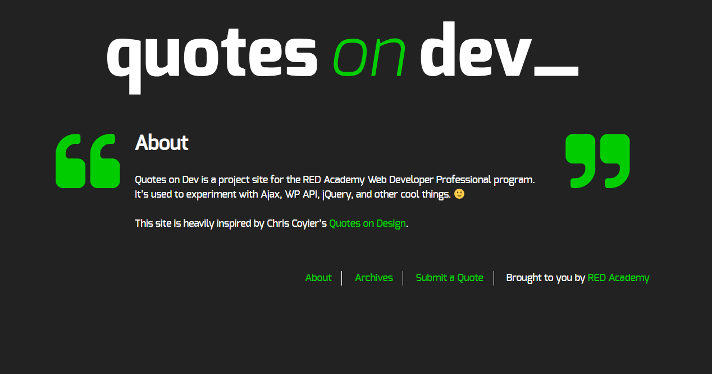
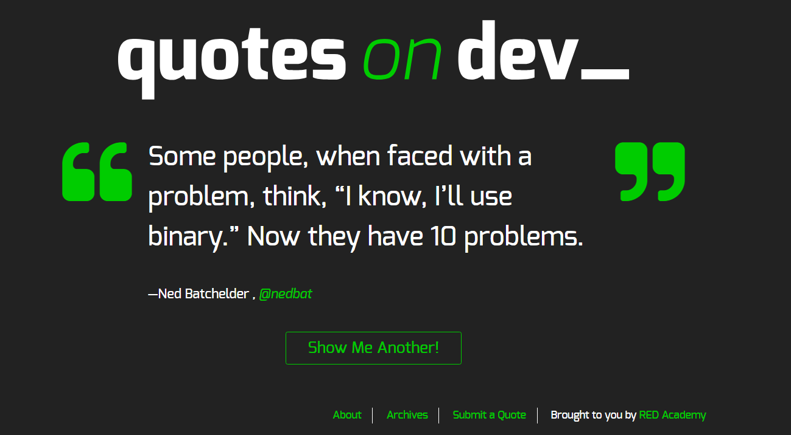

# Quotes on Dev Starter

A WordPress theme for the Quotes on Dev project

## Screenshots




##Author

Emre Kaynak (https://github.com/ekaynak94)

## Technologies Used

-HTLM5
-CSS3/SASS
-JAVASCRIPT ES6/JQUERY
-PHP
-WORDPRESS/REST API

## Installation

- Download or clone repo to Wordpress wp-content/themes directory.
- Run the following commands in the directory:

```bash
cd quotes-on-dev
```

```bash
npm install
```

- Enable custom theme 'quotes-on-dev' in Worldpress dashboard.
